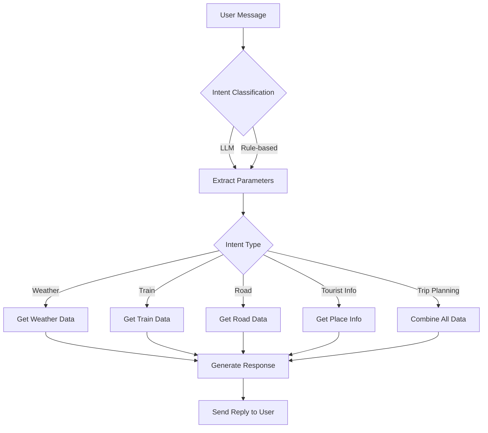

# travel-agent-

A conversational AI-powered travel assistant for India, built with Flask and Hugging Face LLMs. It provides real-time and fallback information about weather, trains, road routes, tourist attractions, and trip planning for Indian cities.

---

## Features

- **Conversational Chatbot**: Interact via a web-based chat UI.
- **Weather Info**: Get current weather for Indian cities.
- **Train Schedules**: Query by train number or between cities.
- **Road Routes**: Get driving time and distance between cities.
- **Tourist Information**: Learn about attractions and best times to visit.
- **Trip Planning**: Get a comprehensive travel plan (multi-modal).
- **Fallback Data**: Uses local JSON data if APIs are unavailable.
- **LLM-powered Intent Parsing**: Uses Hugging Face Llama-3 for robust intent extraction and natural responses, with rule-based fallback.

---

## Project Structure

```
Travel Agent/
│
├── PROMPTFLOW/
│   ├── chat_server.py         # Flask server and API endpoints
│   ├── promptflow_router.py   # Intent parsing, routing, and response generation
│   ├── rail_api.py            # Blueprint for rail API
│   ├── road_api.py            # Blueprint for road API
│   ├── weather_api.py         # Blueprint for weather API
│   ├── updated-data-weather.json
│   ├── updated-json-data-for-train.json
│   ├── updated-routes-data.json
│   ├── tourism-data.json
│  
├── templates/
│   └── index.html             # Chat UI
├── .env                       # Environment variables (not committed)
├── .gitignore
└── README.md
```

---

## How It Works

1. **User Interaction**: User sends a message via the chat UI.
2. **Intent Classification**: The message is parsed using an LLM (Llama-3 via Hugging Face) or a rule-based fallback to determine the user's intent (weather, train, road, etc.).
3. **Parameter Extraction**: Relevant parameters (city, train number, etc.) are extracted.
4. **Data Retrieval**: The system queries APIs (weather, train, road) or uses local JSON data as fallback.
5. **Response Generation**: The LLM generates a conversational answer, or a template-based fallback is used.
6. **Reply**: The answer is sent back to the user.

---

## Setup Instructions

### 1. Clone the Repository

```sh
git clone https://github.com/kuro-2/travel-agent-.git
cd "Travel Agent"
```

### 2. Install Dependencies

It's recommended to use a virtual environment:

```sh
python -m venv venv
venv\Scripts\activate
pip install -r requirements.txt
```

**Main dependencies:**
- Flask
- requests
- python-dotenv
- huggingface_hub

### 3. Prepare Environment Variables

Create a `.env` file in the root directory:

```
HF_TOKEN=your_huggingface_api_token
```

> **Note:** The `.env` file is ignored by git.

### 4. Prepare Data Files

Ensure the following JSON files are present in the `PROMPTFLOW` directory:
- `updated-data-weather.json`
- `updated-json-data-for-train.json`
- `updated-routes-data.json`
- `tourism-data.json`

You can use your own data or sample data for testing.

### 5. Run the Server

```sh
cd PROMPTFLOW
python chat_server.py
```

The server will start on [http://localhost:5000](http://localhost:5000).

### 6. Access the Chat UI

Open your browser and go to [http://localhost:5000](http://localhost:5000) to interact with the assistant.

---

## How to Build a Similar Project

1. **Define Your Use Cases**: Decide what information your assistant should provide.
2. **Collect Data/APIs**: Gather APIs or datasets for your domains (weather, transport, etc.).
3. **Design Intent Schema**: List possible user intents and required parameters.
4. **Build Intent Classifier**: Use an LLM (like Llama-3) or rule-based methods to classify user queries and extract parameters.
5. **Implement Data Retrieval**: Write functions to fetch data from APIs or local files.
6. **Generate Responses**: Use LLMs for natural language generation, or fallback to templates.
7. **Integrate with a Web Framework**: Use Flask or FastAPI to build a backend and serve a chat UI.
8. **Handle Fallbacks**: Always provide fallback data or error messages for robustness.
9. **Test and Iterate**: Test with real user queries and improve intent detection and responses.

---

## Workflow Diagram



---

## Notes

- **LLM Usage**: The project uses Hugging Face's hosted Llama-3 model for intent classification and response generation. If the token is missing or the API fails, it falls back to rule-based logic and template responses.
- **Extensibility**: You can add more APIs, intents, or data sources by extending the router and intent schema.
- **Security**: Never commit your `.env` file or API keys to version control.
- **Customization**: Update the `tourism-data.json` and other data files to include more places or richer information.

---

## License

This project is for educational and demonstration purposes.

---

## Author

Built by an AI travel enthusiast using Python, Flask, and Hugging Face LLMs.
